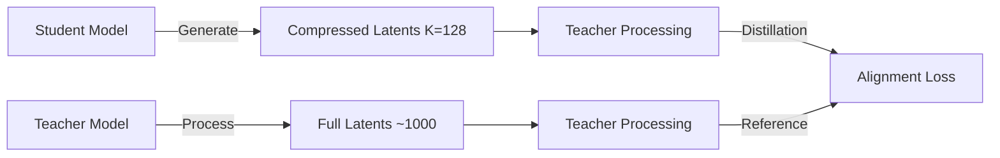
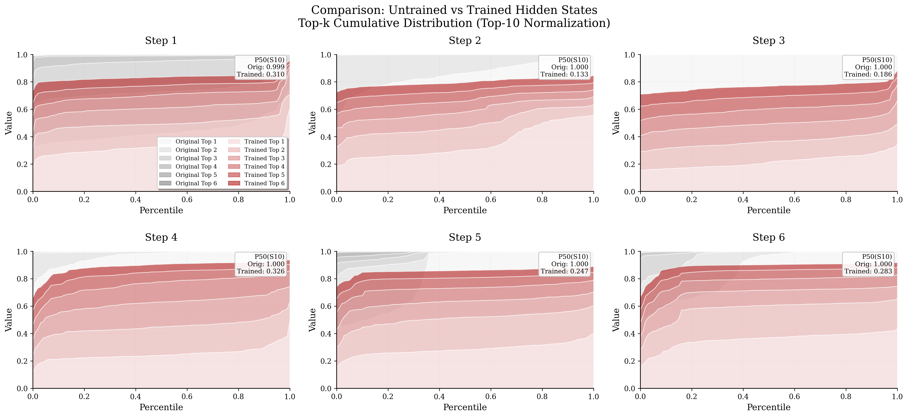

<a name="readme-top"></a>
<h1 align="center">
Interlat: Enabling Agents to Communicate Entirely in Latent Space
</h1>

<p align="center">
    <a href="https://arxiv.org/abs/2511.09149"></a>
    <a href="https://github.com/XiaoDu-flying/Interlat"></a>
    <a href="https://www.apache.org/licenses/LICENSE-2.0"></a>
</p>

## 💡 Introduction

**Interlat** is a novel multi-agent communication framework that enables agents to collaborate **entirely in latent space**, bypassing natural language as the communication medium. Instead of transmitting discrete tokens or chain-of-thought plans, agents directly share their **last-layer hidden states** as representations of internal thoughts, allowing richer, more information-preserving interaction.

Interlat introduces a principled approach to latent communication with the following key features:

- **🧠 Language-free inter-agent communication** — Directly transmitting temporally aligned hidden states as thoughts
- **🔗 Stable and effective latent utilization** — Enabled by supervised training with conditional separation and plan-aligned regularization
- **⚡ Aggressive latent compression** — Reducing communication length by up to 24× while preserving task-critical information
- **🔄 Model-agnostic and cross-family compatible** — Supporting heterogeneous agents without parameter sharing or memory coupling
- **🚀 Superior efficiency** — Achieving substantial inference speedups and improved exploration behavior

Overall, Interlat demonstrates that **latent space can serve as a high-bandwidth, efficient, and general communication channel** for multi-agent systems, achieving superior performance compared to language-based collaboration.

<p align="center"></p>

---

## 🔔 News

- **[2026-1-20]** We have released our code implementations for Interlat!

---

## 📊 Experiments Overview

### ⭐ Main Results

We evaluate **Interlat** on both **interactive embodied planning** and **symbolic reasoning** benchmarks, covering heterogeneous models and multiple communication settings.

* **Table 1 — Interlat on ALFWorld (Seen & Unseen Tasks)**
  Performance comparison across three backbone families (Qwen2.5-7B / Qwen2.5-0.5B / LLaMA3.1-8B), including language-based communication, no-communication, and CoT baselines.

  <p align="center"></p>

* **Table 2 — Interlat on MATH Benchmark**
  Accuracy comparison across different difficulty levels, highlighting Interlat's advantage on higher-complexity problems.

  <p align="center"></p>

* **Table 3 — Latent Compression Results on ALFWorld**
  End-to-end latency and success rates under varying latent lengths (from full trajectories down to 8-step latents), with and without compression training.

  <p align="center"></p>

---

### 🔍 Key Findings

* **Latent communication promotes informed exploration**
  Agents equipped with latent communication consistently achieve **higher success rates with longer trajectories**. Compared to language-based communication, Interlat improves success rates by **+3–8% absolute** on ALFWorld, while increasing average successful trajectory length by **~10–20%**, indicating **deliberate, informed exploration rather than random wandering**.

* **Robust reliance on structured latent semantics**
  Injecting **task-mismatched latents** or applying **geometry-destroying perturbations** leads to **20–40% relative drops in success rate**, despite preserving low-order statistics. This confirms that agents rely on **task-specific latent structure**, rather than superficial distributional cues.

* **Strong cross-model generalization**
  Interlat enables effective communication across **heterogeneous model families** (e.g., Qwen → LLaMA) with **no parameter sharing**. Cross-family latent transfer yields **up to +8–10% absolute gains** over text-based baselines.

---

### ⚡ Superior Efficiency on **Latency and Communication Cost**

By operating entirely in latent space, Interlat substantially improves communication efficiency:

* **Up to 24× reduction in end-to-end communication latency** through latent-space compression
* **Aggressive shortening of communication length**, from full trajectories to as few as **8 latent vectors** (≈1–3% of the original length)
* **No decode–re-encode overhead**, eliminating redundant language generation and tokenization

Despite these reductions, Interlat maintains **competitive or superior task performance**, demonstrating that latent communication preserves **task-critical information** while discarding linguistically induced redundancy.

---

## 🛠️ Getting Started

### ⚙️ Setup Environment Variables

We recommend setting your HuggingFace cache directory to avoid repeated downloads:

```bash
export HF_HOME=/path/to/huggingface
export TRANSFORMERS_CACHE=$HF_HOME
export HF_DATASETS_CACHE=$HF_HOME
```

Models and datasets will automatically be downloaded into `$HF_HOME`.

### 📦 Installation

```bash
# Clone the repository
git clone https://github.com/XiaoDu-flying/Interlat.git
cd Interlat

# Create conda environment
conda create -n interlat python=3.8 -y
conda activate interlat

# Install dependencies
pip install -r requirements.txt

# Optional: Install in development mode
pip install -e .
```

### 🚀 Quick Start

#### Option 1: One-Command Demo (Recommended)

```bash
# Quick demo with ALFWorld
./scripts/quick_start.sh

# Quick demo with Math reasoning
./scripts/quick_start.sh --task math

# Full workflow with larger model
./scripts/quick_start.sh --task alfworld --model-size large --full
```

#### Option 2: Step-by-Step Workflow

**Step 1: Collect Hidden States**

```bash
# ALFWorld data collection
./scripts/collect_alfworld.sh \
    --dataset_path ./datasets/alfworld_dataset.json \
    --temperature 0.7 \
    --output_dir ./data/alfworld_hidden_states

# Math data collection
./scripts/collect_math.sh \
    --mode train \
    --temperature 0.8 \
    --subjects algebra geometry \
    --output_dir ./data/math_hidden_states
```

**Step 2: Train Models**

```bash
# Train with hidden state integration
./scripts/train_model.sh \
    --model "Qwen/Qwen2.5-7B-Instruct" \
    --data "./data/training_data.json" \
    --hidden-data "./data/hidden_states" \
    --epochs 10 \
    --output-dir "./trained_models"
```

#### Option 3: Direct Python Usage

```bash
# Data collection using unified CLI
python data_collection/collect_data.py alfworld \
    --dataset_path ./datasets/alfworld_dataset.json \
    --temperature 0.7 \
    --output_dir ./data/alfworld_hidden_states

# Training with core framework
python core_training/train.py \
    --model_name_or_path "Qwen/Qwen2.5-7B-Instruct" \
    --data_path "./data/training_data.json" \
    --hidden_data_path "./data/hidden_states" \
    --output_dir "./trained_models" \
    --num_train_epochs 10
```

---

## 🔧 Core Components

### 🗃️ Hidden State Collection Pipeline

The data collection framework provides flexible hidden state extraction from language models:

- **📊 Multi-dataset Support**: ALFWorld, MATH reasoning, and custom datasets
- **🎛️ Argument-based Configuration**: No more environment variables!
- **🔧 Flexible Model Support**: Any HuggingFace model with consistent interfaces
- **⚡ Distributed Processing**: Multi-GPU data collection with automatic sharding
- **📦 Multiple Output Formats**: HuggingFace datasets, Parquet files, and custom formats

**Key Features:**
```bash
# Unified CLI with comprehensive argument support
python data_collection/collect_data.py [alfworld|math] [options]

# Automatic data validation and error handling
# Distributed training support with torchrun
# Configurable generation parameters (temperature, top_p, etc.)
# Custom prompt templates and subject filtering
```

### 🧠 Modular Hidden State Processing

Our refactored hidden state processing system provides clean, maintainable components:

- **🏗️ `AdaptiveProjection`**: Dynamic numerical range adaptation for hidden states
- **🔄 `HiddenStateProcessor`**: Multi-head attention and normalization for hidden states
- **📊 `Loss Functions`**: Plan similarity, random contrast, and adaptive weight adjustment
- **🎯 `Token Utils`**: Token insertion, special token handling, and sequence management

**Example Usage:**
```python
from core_training.hidden_model import ModelWithInsertedHiddenState

# Initialize model with hidden state integration
model = ModelWithInsertedHiddenState(
    base_model=base_model,
    prepended_length=1000,
    hidden_size=4096,
    num_heads=32,
    plan_similarity_weight=0.5,
    random_contrast_weight=1.5
)
```

### 🎯 Training Framework

Advanced training techniques optimized for hidden state-enhanced models:

- **🔄 Curriculum Learning**: Progressive training with plan similarity and contrast losses
- **⚖️ Adaptive Loss Balancing**: Dynamic weight adjustment based on loss values
- **🎯 Multi-objective Training**: Cross-entropy, plan similarity, and contrastive objectives
- **💾 Comprehensive Checkpointing**: Model state, optimizer, and training statistics

---

## 🎯 Supported Tasks and Datasets

### 🏠 ALFWorld (Interactive Embodied Planning)
- **Task Type**: Household task execution and planning
- **Communication Mode**: Latent state sharing between planning and execution agents
- **Metrics**: Success rate, trajectory efficiency, exploration behavior
- **Models Tested**: Qwen2.5 (0.5B, 7B), LLaMA3.1-8B

### 🔢 MATH Benchmark (Symbolic Reasoning)
- **Task Type**: Mathematical problem solving across 7 subjects
- **Communication Mode**: Multi-step reasoning with latent thought sharing
- **Metrics**: Accuracy across difficulty levels, reasoning efficiency
- **Models Tested**: Qwen2.5-7B

---

## 🎯 Evaluation and Testing

### 📊 Comprehensive Evaluation Framework

Interlat provides a complete evaluation suite for assessing latent communication performance across multiple benchmarks and metrics.

### 🏠 ALFWorld Evaluation

**Interactive Embodied Planning Tasks**

```bash
# Basic ALFWorld evaluation with latent communication
python eval/alfworld/eval_agent/main.py \
    --model_path ./trained_models/alfworld_model \
    --dataset_path ./data/alfworld_hidden_states \
    --split dev \
    --variants none \
    --output_path ./eval_results/alfworld
```

**Available Evaluation Methods:**
- `none`: Complete hidden states (our method)
- `text`: Replace latent messages with CoT plans
- `no_comm`: Remove communication entirely
- `cot_full`: Complete CoT plans for supervised fine-tuning
- `cross_task`: Cross-task latent transfer
- `covgauss0`/`covgauss1`: Covariance-preserving perturbations
- `randomrot`: Mean/covariance preserving with structure destruction
- `qwen2llama`: Cross-model family evaluation

### 🔢 MATH Reasoning Evaluation

**Multi-step Mathematical Problem Solving**

```bash
# Basic math reasoning evaluation
python eval/math/math_evaluator.py \
    --model_name ./trained_models/math_model \
    --dataset hendrycks/MATH \
    --split test \
    --output_dir ./eval_results/math
```

**Key Features:**
- Automatic answer normalization and comparison
- Robust `\boxed{}` answer extraction with nested brace handling
- Support for multiple samples per question for reliability analysis
- Comprehensive logging with timestamps and model outputs

---

## 🗜️ Latent Compression Training

### 📉 Efficient Communication through Compression

Interlat includes advanced compression training capabilities that significantly reduce communication overhead while preserving task performance.

### 🧠 Teacher-Student Distillation Framework

**Compression Architecture:**



### 🚀 Quick Start with Compression Training

```bash
# Using the convenient shell script
./scripts/train_compression.sh \
    --teacher-model ./trained_models/teacher_model \
    --hidden-repo your_hidden_states_dataset \
    --K 128 \
    --epochs 3
```

**Model Compatibility:**
- **Student Models**: Qwen2.5 (0.5B, 7B), LLaMA3.1-8B, custom architectures
- **Teacher Models**: Pre-trained Interlat models with hidden state processing
- **Cross-Family Training**: Supports heterogeneous teacher-student pairs

### 🔄 Integration with Main Pipeline

**Complete Workflow with Compression:**

```bash
# Step 1: Standard data collection and training
./scripts/quick_start.sh --task alfworld --model-size large

# Step 2: Compression training
./scripts/train_compression.sh \
    --teacher-model ./trained_models/alfworld_model \
    --hidden-repo your_alfworld_hidden_states \
    --K 128 \
    --output-dir ./compressed_models

# Alternative: Direct Python usage
python compression_training/compress.py \
    --student_model_path meta-llama/Llama-3.1-8B-Instruct \
    --teacher_model_path ./trained_models/alfworld_model \
    --hf_hidden_repo your_alfworld_hidden_states \
    --K 128 \
    --output_dir ./compressed_models

# Step 3: Evaluate compressed model
python eval/alfworld/eval_agent/main.py \
    --model_path ./compressed_models \
    --variants none \
    --enable_timing
```

<p align="center"></p>

**Benefits of Compression:**
- **Reduced memory usage** for multi-agent deployment
- **Faster inference** through shorter sequence processing
- **Scalable communication** for large-scale agent systems
- **Maintained performance** across diverse reasoning tasks

---

## 📄 License

This project is licensed under the Apache License 2.0 - see the [LICENSE](LICENSE) file for details.

---

## 📚 Citation

💫 If you find **Interlat** helpful for your research, please kindly give us a star ⭐️ and cite:

```bibtex
@article{du2025latent,
  title={Enabling Agents to Communicate Entirely in Latent Space},
  author={Du, Zhuoyun and Wang, Runze and Bai, Huiyu and Cao, Zouying and Zhu, Xiaoyong and Zheng, Bo and Chen, Wei and Ying, Haochao},
  journal={arXiv preprint arXiv:2511.09149},
  year={2025}
}
```

## 📞 Support

- 🐛 **Bug Reports**: [GitHub Issues](https://github.com/XiaoDu-flying/Interlat/issues)
- 💬 **Discussions**: [GitHub Discussions](https://github.com/XiaoDu-flying/Interlat/discussions)
- 📧 **Email**: duzy@zju.edu.com

---

<div align="center">

⭐ **Star this repository if you find it helpful!** ⭐

**Built with ❤️ for the multi-agent AI research community**

[🔝 Back to Top](#readme-top)

</div>
