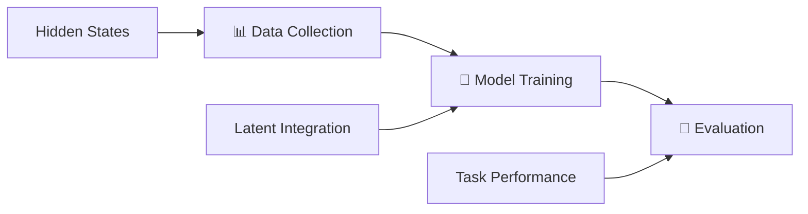
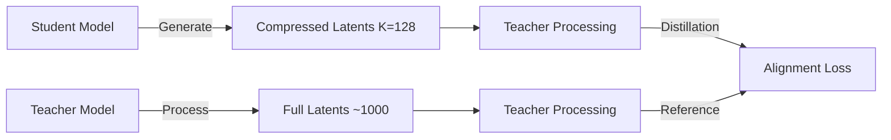

<a name="readme-top"></a>
<h1 align="center">
Interlat: Enabling Agents to Communicate Entirely in Latent Space
</h1>

<p align="center">
    <a href="https://arxiv.org/abs/2511.09149"></a>
    <a href="https://github.com/XiaoDu-flying/Interlat"></a>
    <a href="https://www.apache.org/licenses/LICENSE-2.0"></a>
</p>

## 💡 Introduction

**Interlat** is a novel multi-agent communication framework that enables agents to collaborate **entirely in latent space**, bypassing natural language as the communication medium. Instead of transmitting discrete tokens or chain-of-thought plans, agents directly share their **last-layer hidden states** as representations of internal thoughts, allowing richer, more information-preserving interaction.

Interlat introduces a principled approach to latent communication with the following key features:

- **🧠 Language-free inter-agent communication** — Directly transmitting temporally aligned hidden states as thoughts
- **🔗 Stable and effective latent utilization** — Enabled by supervised training with conditional separation and plan-aligned regularization
- **⚡ Aggressive latent compression** — Reducing communication length by up to 24× while preserving task-critical information
- **🔄 Model-agnostic and cross-family compatible** — Supporting heterogeneous agents without parameter sharing or memory coupling
- **🚀 Superior efficiency** — Achieving substantial inference speedups and improved exploration behavior

Overall, Interlat demonstrates that **latent space can serve as a high-bandwidth, efficient, and general communication channel** for multi-agent systems, achieving superior performance compared to language-based collaboration.

<p align="center"></p>

## 🚀 Quick Start Pipeline

**Interlat follows a simple 3-step workflow:**



### 📋 Complete Workflow Overview

1. **📊 Data Collection** — Extract hidden states from language models on your target tasks
   ```bash
   # Collect ALFWorld hidden states
   ./scripts/collect_alfworld.sh --dataset_path ./data/alfworld_dataset.json

   # Collect Math reasoning hidden states
   ./scripts/collect_math.sh --subjects algebra geometry
   ```

2. **🧠 Model Training** — Train models with hidden state integration for latent communication
   ```bash
   # Train with collected hidden states
   ./scripts/train_model.sh --model Qwen/Qwen2.5-7B --data ./data/train.json

   # Train compressed latent models (optional)
   ./scripts/train_compression.sh --teacher-model ./trained_models --K 128
   ```

3. **🎯 Evaluation** — Test your trained models on downstream tasks
   ```bash
   # Evaluate on ALFWorld tasks
   python eval/alfworld/eval_agent/main.py --model_path ./trained_models --dataset_path ./data/hidden_states

   # Evaluate on Math reasoning
   python eval/math/math_evaluator.py --model_name ./trained_models --dataset hendrycks/MATH
   ```

**🎬 One-Command Demo:**
```bash
# Complete pipeline with ALFWorld (recommended for first-time users)
./scripts/quick_start.sh

# Complete pipeline with Math reasoning
./scripts/quick_start.sh --task math --full
```

---

## 🔔 News

- **[2026-1-15]** We have released our code implementations for Interlat!

---

## 📊 Experiments Overview

### ⭐ Main Results

We evaluate **Interlat** on both **interactive embodied planning** and **symbolic reasoning** benchmarks, covering heterogeneous models and multiple communication settings.

* **Table 1 — Interlat on ALFWorld (Seen & Unseen Tasks)**
  Performance comparison across three backbone families (Qwen2.5-7B / Qwen2.5-0.5B / LLaMA3.1-8B), including language-based communication, no-communication, and CoT baselines.

  <p align="center"></p>

* **Table 2 — Interlat on MATH Benchmark**
  Accuracy comparison across different difficulty levels, highlighting Interlat's advantage on higher-complexity problems.

  <p align="center"></p>

* **Table 3 — Latent Compression Results on ALFWorld**
  End-to-end latency and success rates under varying latent lengths (from full trajectories down to 8-step latents), with and without compression training.

  <p align="center"></p>

---

### 🔍 Key Findings

* **Latent communication promotes informed exploration**
  Agents equipped with latent communication consistently achieve **higher success rates with longer trajectories**. Compared to language-based communication, Interlat improves success rates by **+3–8% absolute** on ALFWorld, while increasing average successful trajectory length by **~10–20%**, indicating **deliberate, informed exploration rather than random wandering**.

* **Robust reliance on structured latent semantics**
  Injecting **task-mismatched latents** or applying **geometry-destroying perturbations** leads to **20–40% relative drops in success rate**, despite preserving low-order statistics. This confirms that agents rely on **task-specific latent structure**, rather than superficial distributional cues.

* **Strong cross-model generalization**
  Interlat enables effective communication across **heterogeneous model families** (e.g., Qwen → LLaMA) with **no parameter sharing**. Cross-family latent transfer yields **up to +8–10% absolute gains** over text-based baselines.

---

### ⚡ Superior Efficiency on **Latency and Communication Cost**

By operating entirely in latent space, Interlat substantially improves communication efficiency:

* **Up to 24× reduction in end-to-end communication latency** through latent-space compression
* **Aggressive shortening of communication length**, from full trajectories to as few as **8 latent vectors** (≈1–3% of the original length)
* **No decode–re-encode overhead**, eliminating redundant language generation and tokenization

Despite these reductions, Interlat maintains **competitive or superior task performance**, demonstrating that latent communication preserves **task-critical information** while discarding linguistically induced redundancy.

---

## 🛠️ Getting Started

### ⚙️ Setup Environment Variables

We recommend setting your HuggingFace cache directory to avoid repeated downloads:

```bash
export HF_HOME=/path/to/huggingface
export TRANSFORMERS_CACHE=$HF_HOME
export HF_DATASETS_CACHE=$HF_HOME
```

Models and datasets will automatically be downloaded into `$HF_HOME`.

### 📦 Installation

```bash
# Clone the repository
git clone https://github.com/XiaoDu-flying/Interlat.git
cd Interlat

# Create conda environment
conda create -n interlat python=3.8 -y
conda activate interlat

# Install dependencies
pip install -r requirements.txt

# Optional: Install in development mode
pip install -e .
```

### 🚀 Quick Start

#### Option 1: One-Command Demo (Recommended)

```bash
# Quick demo with ALFWorld
./scripts/quick_start.sh

# Quick demo with Math reasoning
./scripts/quick_start.sh --task math

# Full workflow with larger model
./scripts/quick_start.sh --task alfworld --model-size large --full
```

#### Option 2: Step-by-Step Workflow

**Step 1: Collect Hidden States**

```bash
# ALFWorld data collection
./scripts/collect_alfworld.sh \
    --dataset_path ./datasets/alfworld_dataset.json \
    --temperature 0.7 \
    --output_dir ./data/alfworld_hidden_states

# Math data collection
./scripts/collect_math.sh \
    --mode train \
    --temperature 0.8 \
    --subjects algebra geometry \
    --output_dir ./data/math_hidden_states
```

**Step 2: Train Models**

```bash
# Train with hidden state integration
./scripts/train_model.sh \
    --model "Qwen/Qwen2.5-7B-Instruct" \
    --data "./data/training_data.json" \
    --hidden-data "./data/hidden_states" \
    --epochs 10 \
    --output-dir "./trained_models"
```

#### Option 3: Direct Python Usage

```bash
# Data collection using unified CLI
python data_collection/collect_data.py alfworld \
    --dataset_path ./datasets/alfworld_dataset.json \
    --temperature 0.7 \
    --output_dir ./data/alfworld_hidden_states

# Training with core framework
python core_training/train.py \
    --model_name_or_path "Qwen/Qwen2.5-7B-Instruct" \
    --data_path "./data/training_data.json" \
    --hidden_data_path "./data/hidden_states" \
    --output_dir "./trained_models" \
    --num_train_epochs 10
```

---

## 📁 Repository Structure

```
Interlat/
├── 📊 data_collection/              # Hidden states data collection pipeline
│   ├── collect_data.py              # 🆕 Unified CLI for data collection
│   ├── alfworld_collection_args.py  # 🆕 ALFWorld collection (argument-based)
│   ├── math_collection_args.py      # 🆕 Math collection (argument-based)
│   ├── config.py                    # Configuration management system
│   ├── base_data_collector.py       # Base data collection framework
│   └── README_args.md               # 🆕 Detailed usage guide
├── 🧠 core_training/                # Streamlined training implementation
│   ├── hidden_model/                # 🆕 Modular hidden state components
│   │   ├── __init__.py              # Package exports
│   │   ├── main_model.py            # Main model with hidden state insertion
│   │   ├── adaptive_projection.py   # Adaptive projection layer
│   │   ├── hidden_state_utils.py    # Hidden state processing utilities
│   │   ├── loss_functions.py        # Specialized loss functions
│   │   └── token_utils.py           # Token manipulation utilities
│   ├── train.py                     # Main training script
│   ├── arguments.py                 # Training argument definitions
│   ├── data_processor.py            # Data processing utilities
│   └── fastchat/                    # FastChat integration
├── 🗜️ compression_training/          # 🆕 Latent compression training framework
│   ├── compress.py                  # Teacher-student distillation training
│   ├── callbacks.py                 # Training callbacks and monitoring
│   └── model_insert_hidden.py      # Hidden state insertion models
├── 🎯 eval/                         # Evaluation scripts and metrics
│   ├── alfworld/eval_agent/         # ALFWorld evaluation framework
│   └── math/                        # Math reasoning evaluation
├── 📚 datasets/                     # Example datasets and data loaders
├── 🔧 scripts/                      # 🆕 Convenient execution scripts
│   ├── quick_start.sh               # 🆕 One-command demo workflow
│   ├── collect_alfworld.sh          # 🆕 ALFWorld data collection script
│   ├── collect_math.sh              # 🆕 Math data collection script
│   ├── train_model.sh               # 🆕 Model training script
│   └── train_compression.sh         # 🆕 Compression training script
├── 🖼️ assets/                       # Figures, diagrams, and visual assets
├── 📖 docs/                         # Documentation (coming soon)
├── ⚙️ requirements.txt              # Python dependencies
├── 🔧 setup.py                      # Package setup configuration
└── 📄 README.md                     # This file
```

---

## 🔧 Core Components

### 🗃️ Hidden State Collection Pipeline

The data collection framework provides flexible hidden state extraction from language models:

- **📊 Multi-dataset Support**: ALFWorld, MATH reasoning, and custom datasets
- **🎛️ Argument-based Configuration**: No more environment variables!
- **🔧 Flexible Model Support**: Any HuggingFace model with consistent interfaces
- **⚡ Distributed Processing**: Multi-GPU data collection with automatic sharding
- **📦 Multiple Output Formats**: HuggingFace datasets, Parquet files, and custom formats

**Key Features:**
```bash
# Unified CLI with comprehensive argument support
python data_collection/collect_data.py [alfworld|math] [options]

# Automatic data validation and error handling
# Distributed training support with torchrun
# Configurable generation parameters (temperature, top_p, etc.)
# Custom prompt templates and subject filtering
```

### 🧠 Modular Hidden State Processing

Our refactored hidden state processing system provides clean, maintainable components:

- **🏗️ `AdaptiveProjection`**: Dynamic numerical range adaptation for hidden states
- **🔄 `HiddenStateProcessor`**: Multi-head attention and normalization for hidden states
- **📊 `Loss Functions`**: Plan similarity, random contrast, and adaptive weight adjustment
- **🎯 `Token Utils`**: Token insertion, special token handling, and sequence management

**Example Usage:**
```python
from core_training.hidden_model import ModelWithInsertedHiddenState

# Initialize model with hidden state integration
model = ModelWithInsertedHiddenState(
    base_model=base_model,
    prepended_length=1000,
    hidden_size=4096,
    num_heads=32,
    plan_similarity_weight=0.5,
    random_contrast_weight=1.5
)
```

### 🎯 Training Framework

Advanced training techniques optimized for hidden state-enhanced models:

- **🔄 Curriculum Learning**: Progressive training with plan similarity and contrast losses
- **⚖️ Adaptive Loss Balancing**: Dynamic weight adjustment based on loss values
- **🎯 Multi-objective Training**: Cross-entropy, plan similarity, and contrastive objectives
- **💾 Comprehensive Checkpointing**: Model state, optimizer, and training statistics

---

## 🎯 Supported Tasks and Datasets

### 🏠 ALFWorld (Interactive Embodied Planning)
- **Task Type**: Household task execution and planning
- **Communication Mode**: Latent state sharing between planning and execution agents
- **Metrics**: Success rate, trajectory efficiency, exploration behavior
- **Models Tested**: Qwen2.5 (0.5B, 7B), LLaMA3.1-8B

### 🔢 MATH Benchmark (Symbolic Reasoning)
- **Task Type**: Mathematical problem solving across 7 subjects
- **Communication Mode**: Multi-step reasoning with latent thought sharing
- **Metrics**: Accuracy across difficulty levels, reasoning efficiency
- **Models Tested**: Qwen2.5-7B

### 🔧 Custom Task Integration

Easily adapt Interlat to new domains:

```python
# Custom data collection
python data_collection/collect_data.py custom \
    --dataset_path ./my_custom_data.json \
    --task_field "question" \
    --response_field "answer" \
    --temperature 0.8

# Custom training configuration
from core_training.hidden_model import create_config_for_task

config = create_config_for_task(
    task_type="custom_reasoning",
    model_path="your-model",
    hidden_length=512,
    num_heads=16
)
```

---

## 🛠️ Advanced Usage

### 🔄 Distributed Training

```bash
# Multi-GPU data collection
./scripts/collect_alfworld.sh --distributed --num_gpus 4

# Multi-GPU training with DeepSpeed
./scripts/train_model.sh \
    --distributed --num_gpus 8 \
    --deepspeed configs/ds_stage2.json \
    --batch-size 4
```

### 🎛️ Custom Model Configuration

```python
from core_training.hidden_model import ModelWithInsertedHiddenState, AdaptiveProjection

# Advanced configuration
model = ModelWithInsertedHiddenState(
    base_model=base_model,
    prepended_length=2000,         # Longer latent sequences
    hidden_size=4096,              # Match your base model
    num_heads=32,                  # More attention heads
    plan_similarity_weight=0.8,    # Stronger plan alignment
    random_contrast_weight=2.0,    # Enhanced contrastive learning
    prepended_input_dim=3584       # Custom projection if needed
)
```

### 📊 Custom Loss Functions

```python
from core_training.hidden_model.loss_functions import calculate_plan_similarity_loss

# Use individual loss components
plan_loss = calculate_plan_similarity_loss(
    normal_logits, plan_logits,
    attention_mask_n, attention_mask_p,
    labels_n, labels_p,
    margin_kl=0.9,        # Stronger KL penalty
    margin_cos=0.4        # Enhanced cosine similarity
)
```

## 🎯 Evaluation and Testing

### 📊 Comprehensive Evaluation Framework

Interlat provides a complete evaluation suite for assessing latent communication performance across multiple benchmarks and metrics.

### 🏠 ALFWorld Evaluation

**Interactive Embodied Planning Tasks**

```bash
# Basic ALFWorld evaluation with latent communication
python eval/alfworld/eval_agent/main.py \
    --model_path ./trained_models/alfworld_model \
    --dataset_path ./data/alfworld_hidden_states \
    --split dev \
    --variants none \
    --output_path ./eval_results/alfworld

# Text-based baseline evaluation
python eval/alfworld/eval_agent/main.py \
    --model_path ./trained_models/alfworld_model \
    --dataset_path ./data/alfworld_hidden_states \
    --split dev \
    --variants text \
    --output_path ./eval_results/alfworld_text

# Cross-model evaluation (Qwen to LLaMA transfer)
python eval/alfworld/eval_agent/main.py \
    --model_path ./trained_models/llama_model \
    --dataset_path ./data/qwen_hidden_states \
    --split dev \
    --variants qwen2llama \
    --output_path ./eval_results/cross_model

# Performance analysis with timing
python eval/alfworld/eval_agent/main.py \
    --model_path ./trained_models/alfworld_model \
    --dataset_path ./data/alfworld_hidden_states \
    --split dev \
    --variants none \
    --enable_timing \
    --output_path ./eval_results/performance
```

**Evaluation Metrics:**
- **Success Rate**: Task completion percentage
- **Trajectory Length**: Average steps to completion
- **Exploration Quality**: Informed vs. random exploration behavior
- **Communication Efficiency**: Latent compression vs. text-based communication

**Available Evaluation Methods:**
- `none`: Complete hidden states (our method)
- `text`: Replace latent messages with CoT plans
- `no_comm`: Remove communication entirely
- `cot_full`: Complete CoT plans for supervised fine-tuning
- `cross_task`: Cross-task latent transfer
- `covgauss0`/`covgauss1`: Covariance-preserving perturbations
- `randomrot`: Mean/covariance preserving with structure destruction
- `qwen2llama`: Cross-model family evaluation

### 🔢 MATH Reasoning Evaluation

**Multi-step Mathematical Problem Solving**

```bash
# Basic math reasoning evaluation
python eval/math/math_evaluator.py \
    --model_name ./trained_models/math_model \
    --dataset hendrycks/MATH \
    --split test \
    --output_dir ./eval_results/math

# Evaluation with multiple samples per question
python eval/math/math_evaluator.py \
    --model_name ./trained_models/math_model \
    --dataset hendrycks/MATH \
    --split test \
    --samples_per_question 5 \
    --output_dir ./eval_results/math_multi_sample

# Limited evaluation for quick testing
python eval/math/math_evaluator.py \
    --model_name ./trained_models/math_model \
    --dataset hendrycks/MATH \
    --split test \
    --num_samples 100 \
    --temperature 0.0 \
    --output_dir ./eval_results/math_quick

# Custom generation parameters
python eval/math/math_evaluator.py \
    --model_name ./trained_models/math_model \
    --dataset hendrycks/MATH \
    --split test \
    --max_length 4096 \
    --temperature 0.7 \
    --do_sample \
    --output_dir ./eval_results/math_sampling
```

**Evaluation Metrics:**
- **Accuracy**: Percentage of correctly solved problems
- **Answer Extraction**: Uses LaTeX `\boxed{}` format extraction
- **Multiple Sampling**: Support for multiple attempts per question
- **Detailed Logging**: JSONL format results with complete model outputs

**Key Features:**
- Automatic answer normalization and comparison
- Robust `\boxed{}` answer extraction with nested brace handling
- Support for multiple samples per question for reliability analysis
- Comprehensive logging with timestamps and model outputs

### 🔬 Advanced Evaluation Features

#### **Comprehensive Evaluation Pipeline**

Run complete evaluations across both benchmarks:

```bash
# ALFWorld comprehensive evaluation
for variant in none text no_comm cot_full cross_task covgauss0 randomrot; do
    python eval/alfworld/eval_agent/main.py \
        --model_path ./trained_models/alfworld_model \
        --dataset_path ./data/alfworld_hidden_states \
        --split dev \
        --variants $variant \
        --enable_timing \
        --output_path ./eval_results/alfworld_$variant
done

# Math comprehensive evaluation
python eval/math/math_evaluator.py \
    --model_name ./trained_models/math_model \
    --dataset hendrycks/MATH \
    --split test \
    --samples_per_question 3 \
    --output_dir ./eval_results/math_comprehensive
```

#### **Performance Analysis**

The ALFWorld evaluator includes detailed performance monitoring:

- **Wall-clock time**: Total execution time per task
- **Model inference time**: Time spent on model generation
- **Token generation rate**: Tokens per second metrics
- **Memory usage**: Peak GPU memory consumption
- **CSV logging**: Structured performance data export

### 📊 Output Structure and Results

**ALFWorld Results:**
- Individual task results as JSON files
- Performance metrics in CSV format (when `--enable_timing` is used)
- Success rates and trajectory length statistics
- Detailed logs with step-by-step execution traces

**Math Results:**
- `detailed_results.jsonl`: Complete evaluation results with model outputs
- `summary.json`: Aggregated statistics and configuration
- Automatic accuracy calculation with confidence intervals
- Support for analysis across problem difficulty levels

### 🎛️ Evaluation Configuration

**ALFWorld Configuration Files:**
- `eval/alfworld/eval_agent/configs/task/alfworld.json`: Task configuration
- `eval/alfworld/eval_agent/configs/model/hidden.json`: Model configuration
- Model and dataset paths can be configured via command-line arguments or config files

**Math Evaluation Configuration:**
- Model selection via `--model_name` argument
- Dataset specification via `--dataset` argument
- Generation parameters (`--temperature`, `--max_length`, etc.) configurable
- Output directory and format customizable

**Configuration Examples:**

```bash
# ALFWorld with custom configurations
python eval/alfworld/eval_agent/main.py \
    --model_key qwen7b_base_v1 \
    --dataset_key qwen7b \
    --exp_config alfworld \
    --agent_config hidden \
    --split dev

# Math with custom model and parameters
python eval/math/math_evaluator.py \
    --model_name ./trained_models/qwen2.5-7b-math \
    --tokenizer_name Qwen/Qwen2.5-7B-Instruct \
    --device cuda \
    --temperature 0.1 \
    --max_length 4096
```

### 📊 Sample Results

**ALFWorld Performance (Success Rate %)**:
```
Communication Mode    | Qwen2.5-7B | Qwen2.5-0.5B | LLaMA3.1-8B
---------------------|------------|--------------|-------------
Text-based           | 76.3       | 68.1         | 73.7
Interlat (Latent)    | 84.1 (+7.8)| 75.4 (+7.3)  | 81.2 (+7.5)
No Communication     | 59.2       | 51.8         | 56.4
```

**MATH Reasoning (Accuracy %)**:
```
Difficulty Level     | Text-based | Interlat | Improvement
---------------------|------------|----------|------------
Level 1-2 (Easy)     | 82.4       | 85.7     | +3.3
Level 3 (Medium)     | 64.2       | 69.8     | +5.6
Level 4-5 (Hard)     | 38.7       | 45.2     | +6.5
```

For detailed results and analysis, see our paper and the `eval_results/` directory after running evaluations.

---

## 🗜️ Latent Compression Training

### 📉 Efficient Communication through Compression

Interlat includes advanced compression training capabilities that significantly reduce communication overhead while preserving task performance.

### 🧠 Teacher-Student Distillation Framework

**Compression Architecture:**



### 🚀 Quick Start with Compression Training

```bash
# Using the convenient shell script
./scripts/train_compression.sh \
    --teacher-model ./trained_models/teacher_model \
    --hidden-repo your_hidden_states_dataset \
    --K 128 \
    --epochs 3

# Direct Python usage with open source models
python compression_training/compress.py \
    --student_model_path meta-llama/Llama-3.1-8B-Instruct \
    --teacher_model_path ./trained_models/teacher_model \
    --data_path ./data/alfworld_sft.json \
    --hf_hidden_repo your_hidden_states_dataset \
    --K 128 \
    --num_train_epochs 3

# Advanced compression with custom parameters
python compression_training/compress.py \
    --student_model_path Qwen/Qwen2.5-7B-Instruct \
    --teacher_model_path ./trained_models/qwen_teacher \
    --K 256 \
    --learning_rate 5e-5 \
    --per_device_train_batch_size 4 \
    --bf16 \
    --gradient_checkpointing
```

### 🔬 Compression Training Features

#### **Multi-Loss Training Framework**

1. **Cross-Entropy Loss** (`λ=1.0`): Standard language modeling objective
2. **Uncertainty-Weighted KL Divergence** (`λ=0.1`): Focus compression on uncertain regions
3. **Alignment Loss** (`λ=0.1`): Ensure semantic consistency between compressed and original latents

#### **Advanced Distillation Techniques**

- **Frozen Teacher Architecture**: Teacher model parameters completely frozen during training
- **Uncertainty-Based Weighting**: Prioritize compression quality in high-uncertainty regions
- **Temporal Window Focus**: Concentrate training on post-insertion token windows
- **Adaptive Projection Layers**: Learnable scaling and projection for optimal latent processing

### 📊 Compression Results

**Latency Reduction:**
- **24× communication speedup** through aggressive latent compression
- **1-3% of original length** while maintaining task performance
- **No decode-reencode overhead** for pure latent communication

**Performance Preservation:**
- Maintains **competitive success rates** on ALFWorld tasks
- **Robust semantic alignment** between compressed and full representations
- **Cross-model compatibility** with heterogeneous agent architectures

### ⚙️ Configuration Options

**Key Parameters:**

```python
# Compression length (default: 128)
--K 128

# Loss weights for multi-objective training
lambda_ce = 1.0      # Cross-entropy weight
lambda_kl = 0.1      # KL divergence weight
lambda_align = 0.1   # Alignment weight

# Training efficiency
--bf16                      # Use bfloat16 precision
--gradient_checkpointing    # Enable gradient checkpointing
--per_device_train_batch_size 2
```

**Model Compatibility:**
- **Student Models**: Qwen2.5 (0.5B, 7B), LLaMA3.1-8B, custom architectures
- **Teacher Models**: Pre-trained Interlat models with hidden state processing
- **Cross-Family Training**: Supports heterogeneous teacher-student pairs

### 🔄 Integration with Main Pipeline

**Complete Workflow with Compression:**

```bash
# Step 1: Standard data collection and training
./scripts/quick_start.sh --task alfworld --model-size large

# Step 2: Compression training
./scripts/train_compression.sh \
    --teacher-model ./trained_models/alfworld_model \
    --hidden-repo your_alfworld_hidden_states \
    --K 128 \
    --output-dir ./compressed_models

# Alternative: Direct Python usage
python compression_training/compress.py \
    --student_model_path meta-llama/Llama-3.1-8B-Instruct \
    --teacher_model_path ./trained_models/alfworld_model \
    --hf_hidden_repo your_alfworld_hidden_states \
    --K 128 \
    --output_dir ./compressed_models

# Step 3: Evaluate compressed model
python eval/alfworld/eval_agent/main.py \
    --model_path ./compressed_models \
    --variants none \
    --enable_timing
```

**Benefits of Compression:**
- **Reduced memory usage** for multi-agent deployment
- **Faster inference** through shorter sequence processing
- **Scalable communication** for large-scale agent systems
- **Maintained performance** across diverse reasoning tasks

---

## 🤝 Contributing

We welcome contributions! Please see our [Contributing Guide](CONTRIBUTING.md) for details.

### Development Setup

```bash
# Clone and setup development environment
git clone https://github.com/XiaoDu-flying/Interlat.git
cd Interlat

# Create development environment
python -m venv venv
source venv/bin/activate  # On Windows: venv\Scripts\activate

# Install in development mode
pip install -e ".[dev]"

# Run tests
pytest tests/

# Format code
black .
isort .
```

---

## 📄 License

This project is licensed under the Apache License 2.0 - see the [LICENSE](LICENSE) file for details.

```
Copyright 2026 Interlat Contributors

Licensed under the Apache License, Version 2.0 (the "License");
you may not use this file except in compliance with the License.
You may obtain a copy of the License at

    http://www.apache.org/licenses/LICENSE-2.0

Unless required by applicable law or agreed to in writing, software
distributed under the License is distributed on an "AS IS" BASIS,
WITHOUT WARRANTIES OR CONDITIONS OF ANY KIND, either express or implied.
See the License for the specific language governing permissions and
limitations under the License.
```

---

## 📚 Citation

💫 If you find **Interlat** helpful for your research, please kindly give us a star ⭐️ and cite:

```bibtex
@article{du2025latent,
  title={Enabling Agents to Communicate Entirely in Latent Space},
  author={Du, Zhuoyun and Wang, Runze and Bai, Huiyu and Cao, Zouying and Zhu, Xiaoyong and Zheng, Bo and Chen, Wei and Ying, Haochao},
  journal={arXiv preprint arXiv:2511.09149},
  year={2025}
}
```

---

## 🙏 Acknowledgments

- [🤗 Hugging Face Transformers](https://github.com/huggingface/transformers) for the base model implementations
- [⚡ DeepSpeed](https://github.com/microsoft/DeepSpeed) for distributed training support
- [💬 FastChat](https://github.com/lm-sys/FastChat) for conversation handling utilities
- [🏠 ALFWorld](https://alfworld.github.io/) for interactive instruction following benchmarks
- [🔢 MATH Dataset](https://github.com/hendrycks/math) for mathematical reasoning evaluation

---

## 📞 Support

- 🐛 **Bug Reports**: [GitHub Issues](https://github.com/XiaoDu-flying/Interlat/issues)
- 💬 **Discussions**: [GitHub Discussions](https://github.com/XiaoDu-flying/Interlat/discussions)
- 📧 **Email**: duzy@zju.edu.com

---

<div align="center">

⭐ **Star this repository if you find it helpful!** ⭐

**Built with ❤️ for the multi-agent AI research community**

[🔝 Back to Top](#readme-top)

</div>
