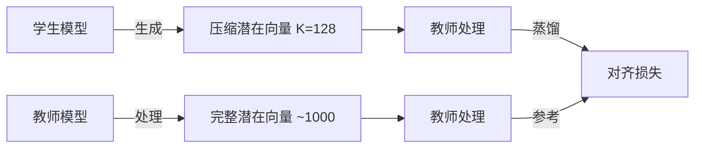

<a name="readme-top"></a>

<p align="center">
    <a href="README.md">English</a> | <a href="README_zh.md">中文</a>
</p>

<h1 align="center">
Interlat: 让智能体完全在潜在空间中通信
</h1>

<p align="center">
    <a href="https://arxiv.org/abs/2511.09149"></a>
    <a href="https://github.com/XiaoDu-flying/Interlat"></a>
    <a href="https://www.apache.org/licenses/LICENSE-2.0"></a>
</p>

## 💡 简介

**Interlat** 是一个新颖的多智能体通信框架，使智能体能够**完全在潜在空间中**进行协作，绕过自然语言作为通信媒介。智能体不再传输离散的 token 或思维链计划，而是直接共享其**最后一层的隐藏状态**作为内部思想的表示，从而实现更丰富、更具信息保留性的交互。

Interlat 提出了一种有原则的潜在通信方法，具有以下核心特性：

- **🧠 无语言智能体间通信** — 直接传输时间对齐的隐藏状态作为思想
- **🔗 稳定有效的潜在状态利用** — 通过条件分离和计划对齐正则化的监督训练实现
- **⚡ 激进的潜在压缩** — 在保留任务关键信息的同时将通信长度减少最多 24 倍
- **🔄 模型无关且跨系列兼容** — 支持异构智能体，无需参数共享或内存耦合
- **🚀 卓越的效率** — 实现显著的推理加速和改进的探索行为

总体而言，Interlat 证明了**潜在空间可以作为多智能体系统的高带宽、高效和通用通信通道**，相比基于语言的协作取得了更优的性能。

<p align="center"></p>

---

## 🔔 新闻

- **[2026-4-7]** 我们的论文被 ACL 2026 接收！
- **[2026-1-20]** 我们发布了 Interlat 的代码实现！

---

## 📊 实验概览

### ⭐ 主要结果

我们在**交互式具身规划**和**符号推理**基准上评估了 **Interlat**，涵盖异构模型和多种通信设置。

* **表 1 — Interlat 在 ALFWorld 上的结果（已见 & 未见任务）**
  三个骨干模型系列（Qwen2.5-7B / Qwen2.5-0.5B / LLaMA3.1-8B）的性能比较，包括基于语言的通信、无通信和 CoT 基线。

  <p align="center"></p>

* **表 2 — Interlat 在 MATH 基准上的结果**
  不同难度级别的准确率比较，突出了 Interlat 在更高复杂度问题上的优势。

  <p align="center"></p>

* **表 3 — ALFWorld 上的潜在压缩结果**
  不同潜在长度（从完整轨迹到 8 步潜在向量）下的端到端延迟和成功率，包含有无压缩训练的对比。

  <p align="center"></p>

---

### 🔍 关键发现

* **潜在通信促进有信息的探索**
  配备潜在通信的智能体始终实现**更高的成功率和更长的轨迹**。与基于语言的通信相比，Interlat 在 ALFWorld 上将成功率提高了 **+3–8% 绝对值**，同时将平均成功轨迹长度增加约 **10–20%**，表明这是**有目的的有信息探索，而非随机游走**。

* **对结构化潜在语义的鲁棒依赖**
  注入**任务不匹配的潜在状态**或应用**破坏几何结构的扰动**会导致成功率**相对下降 20–40%**，尽管保留了低阶统计量。这证实了智能体依赖的是**任务特定的潜在结构**，而非表面的分布线索。

* **强大的跨模型泛化能力**
  Interlat 能够在**异构模型系列**（如 Qwen → LLaMA）之间实现有效通信，**无需参数共享**。跨系列潜在传输相比文本基线获得了**高达 +8–10% 绝对值的提升**。

---

### ⚡ 在**延迟和通信成本**上的卓越效率

通过完全在潜在空间中运行，Interlat 显著提高了通信效率：

* 通过潜在空间压缩实现**高达 24 倍的端到端通信延迟降低**
* **大幅缩短通信长度**，从完整轨迹到最少 **8 个潜在向量**（约占原始长度的 1–3%）
* **无解码-重编码开销**，消除了冗余的语言生成和分词

尽管有这些缩减，Interlat 仍保持了**具有竞争力或更优的任务性能**，证明潜在通信在丢弃语言诱导的冗余的同时保留了**任务关键信息**。

---

## 🛠️ 快速开始

### ⚙️ 设置环境变量

我们建议设置 HuggingFace 缓存目录以避免重复下载：

```bash
export HF_HOME=/path/to/huggingface
export TRANSFORMERS_CACHE=$HF_HOME
export HF_DATASETS_CACHE=$HF_HOME
```

模型和数据集将自动下载到 `$HF_HOME`。

### 📦 安装

```bash
# 克隆仓库
git clone https://github.com/XiaoDu-flying/Interlat.git
cd Interlat

# 创建 conda 环境
conda create -n interlat python=3.8 -y
conda activate interlat

# 安装依赖
pip install -r requirements.txt

# 可选：以开发模式安装
pip install -e .
```

### 🚀 快速开始

#### 方式一：一键演示（推荐）

```bash
# ALFWorld 快速演示
./scripts/quick_start.sh

# 数学推理快速演示
./scripts/quick_start.sh --task math

# 使用大模型的完整工作流
./scripts/quick_start.sh --task alfworld --model-size large --full
```

#### 方式二：分步工作流

**第一步：收集隐藏状态**

```bash
# ALFWorld 数据收集
./scripts/collect_alfworld.sh \
    --dataset_path ./datasets/alfworld_dataset.json \
    --temperature 0.7 \
    --output_dir ./data/alfworld_hidden_states

# 数学数据收集
./scripts/collect_math.sh \
    --mode train \
    --temperature 0.8 \
    --subjects algebra geometry \
    --output_dir ./data/math_hidden_states
```

**第二步：训练模型**

```bash
# 使用隐藏状态集成进行训练
./scripts/train_model.sh \
    --model "Qwen/Qwen2.5-7B-Instruct" \
    --data "./data/training_data.json" \
    --hidden-data "./data/hidden_states" \
    --epochs 10 \
    --output-dir "./trained_models"
```

#### 方式三：直接使用 Python

```bash
# 使用统一 CLI 收集数据
python data_collection/collect_data.py alfworld \
    --dataset_path ./datasets/alfworld_dataset.json \
    --temperature 0.7 \
    --output_dir ./data/alfworld_hidden_states

# 使用核心框架训练
python core_training/train.py \
    --model_name_or_path "Qwen/Qwen2.5-7B-Instruct" \
    --data_path "./data/training_data.json" \
    --hidden_data "./data/hidden_states" \
    --output_dir "./trained_models" \
    --num_train_epochs 10
```

---

## 🔧 核心组件

### 🗃️ 隐藏状态收集管道

数据收集框架提供灵活的语言模型隐藏状态提取功能：

- **📊 多数据集支持**：ALFWorld、MATH 推理和自定义数据集
- **🎛️ 基于参数的配置**：无需环境变量！
- **🔧 灵活的模型支持**：任何 HuggingFace 模型，接口一致
- **⚡ 分布式处理**：多 GPU 数据收集，自动分片
- **📦 多种输出格式**：HuggingFace 数据集、Parquet 文件和自定义格式

**关键特性：**
```bash
# 统一 CLI，支持全面的参数配置
python data_collection/collect_data.py [alfworld|math] [选项]

# 自动数据验证和错误处理
# 支持 torchrun 分布式训练
# 可配置的生成参数（temperature、top_p 等）
# 自定义提示模板和学科过滤
```

### 🧠 模块化隐藏状态处理

我们重构的隐藏状态处理系统提供清晰、可维护的组件：

- **🏗️ `AdaptiveProjection`**：隐藏状态的动态数值范围适配
- **🔄 `HiddenStateProcessor`**：多头注意力和归一化处理隐藏状态
- **📊 `Loss Functions`**：计划相似性、随机对比和自适应权重调整
- **🎯 `Token Utils`**：Token 插入、特殊 token 处理和序列管理

**使用示例：**
```python
from core_training.hidden_model import ModelWithInsertedHiddenState

# 初始化带有隐藏状态集成的模型
model = ModelWithInsertedHiddenState(
    base_model=base_model,
    prepended_length=1000,
    hidden_size=4096,
    num_heads=32,
    plan_similarity_weight=0.5,
    random_contrast_weight=1.5
)
```

### 🎯 训练框架

针对隐藏状态增强模型优化的高级训练技术：

- **🔄 课程学习**：通过计划相似性和对比损失进行渐进式训练
- **⚖️ 自适应损失平衡**：基于损失值的动态权重调整
- **🎯 多目标训练**：交叉熵、计划相似性和对比目标
- **💾 全面的检查点**：模型状态、优化器和训练统计

---

## 🎯 支持的任务和数据集

### 🏠 ALFWorld（交互式具身规划）
- **任务类型**：家庭任务执行和规划
- **通信模式**：规划和执行智能体之间的潜在状态共享
- **评估指标**：成功率、轨迹效率、探索行为
- **测试模型**：Qwen2.5 (0.5B, 7B)、LLaMA3.1-8B

### 🔢 MATH 基准（符号推理）
- **任务类型**：涵盖 7 个学科的数学问题求解
- **通信模式**：带有潜在思想共享的多步推理
- **评估指标**：不同难度级别的准确率、推理效率
- **测试模型**：Qwen2.5-7B

---

## 🎯 评估与测试

### 📊 综合评估框架

Interlat 提供了完整的评估套件，用于评估多个基准和指标下的潜在通信性能。

### 🏠 ALFWorld 评估

**交互式具身规划任务**

```bash
# 使用潜在通信的基本 ALFWorld 评估
python eval/alfworld/eval_agent/main.py \
    --model_path ./trained_models/alfworld_model \
    --dataset_path ./data/alfworld_hidden_states \
    --split dev \
    --variants none \
    --output_path ./eval_results/alfworld
```

**可用的评估方法：**
- `none`：完整隐藏状态（我们的方法）
- `text`：用 CoT 计划替换潜在消息
- `no_comm`：完全移除通信
- `cot_full`：完整 CoT 计划用于监督微调
- `cross_task`：跨任务潜在传输
- `covgauss0`/`covgauss1`：协方差保留扰动
- `randomrot`：均值/协方差保留但结构破坏
- `qwen2llama`：跨模型系列评估

### 🔢 MATH 推理评估

**多步数学问题求解**

```bash
# 基本数学推理评估
python eval/math/math_evaluator.py \
    --model_name ./trained_models/math_model \
    --dataset hendrycks/MATH \
    --split test \
    --output_dir ./eval_results/math
```

---

## 🗜️ 潜在压缩训练

### 📉 通过压缩实现高效通信

Interlat 包含先进的压缩训练功能，在保持任务性能的同时显著减少通信开销。

### 🧠 教师-学生蒸馏框架

**压缩架构：**



### 🚀 压缩训练快速开始

```bash
# 使用便捷的 shell 脚本
./scripts/train_compression.sh \
    --teacher-model ./trained_models/teacher_model \
    --hidden-repo your_hidden_states_dataset \
    --K 128 \
    --epochs 3
```

**模型兼容性：**
- **学生模型**：Qwen2.5 (0.5B, 7B)、LLaMA3.1-8B、自定义架构
- **教师模型**：预训练的 Interlat 模型（含隐藏状态处理）
- **跨系列训练**：支持异构教师-学生对

### 🔄 与主流程集成

**包含压缩的完整工作流：**

```bash
# 第一步：标准数据收集和训练
./scripts/quick_start.sh --task alfworld --model-size large

# 第二步：压缩训练
./scripts/train_compression.sh \
    --teacher-model ./trained_models/alfworld_model \
    --hidden-repo your_alfworld_hidden_states \
    --K 128 \
    --output-dir ./compressed_models

# 替代方案：直接使用 Python
python compression_training/compress.py \
    --student_model_path meta-llama/Llama-3.1-8B-Instruct \
    --teacher_model_path ./trained_models/alfworld_model \
    --hf_hidden_repo your_alfworld_hidden_states \
    --K 128 \
    --output_dir ./compressed_models

# 第三步：评估压缩模型
python eval/alfworld/eval_agent/main.py \
    --model_path ./compressed_models \
    --variants none \
    --enable_timing
```

<p align="center"></p>

**压缩的优势：**
- **减少内存使用**，便于多智能体部署
- **更快的推理**，通过更短的序列处理
- **可扩展的通信**，适用于大规模智能体系统
- **保持性能**，在多种推理任务上

---

## 📄 许可证

本项目采用 Apache License 2.0 许可 - 详见 [LICENSE](LICENSE) 文件。

---

## 📚 引用

💫 如果您发现 **Interlat** 对您的研究有帮助，请给我们一个 star ⭐️ 并引用：

```bibtex
@article{du2025latent,
  title={Enabling Agents to Communicate Entirely in Latent Space},
  author={Du, Zhuoyun and Wang, Runze and Bai, Huiyu and Cao, Zouying and Zhu, Xiaoyong and Zheng, Bo and Chen, Wei and Ying, Haochao},
  journal={arXiv preprint arXiv:2511.09149},
  year={2025}
}
```

## 📞 支持

- 🐛 **Bug 报告**：[GitHub Issues](https://github.com/XiaoDu-flying/Interlat/issues)
- 💬 **讨论**：[GitHub Discussions](https://github.com/XiaoDu-flying/Interlat/discussions)
- 📧 **邮箱**：duzy@zju.edu.com

---

<div align="center">

[🔝 返回顶部](#readme-top)

</div>
